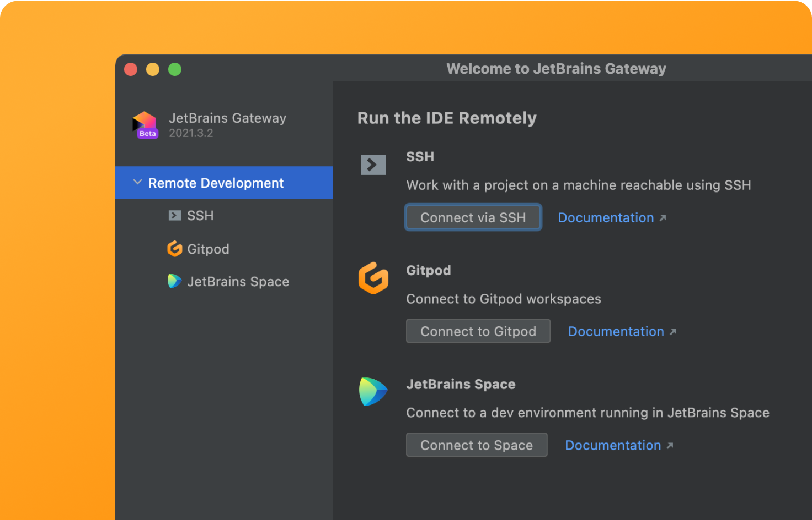

# {title}

[JetBrains Gateway](https://www.jetbrains.com/remote-development/gateway/) is your single entry point to all remote development environments when using JetBrains IDE's. JetBrains Gateway is a compact desktop app that allows you to work remotely with a JetBrains IDE without even downloading one.

Using JetBrains Gateway on Desktop with Gitpod, allows you to:

1. Create a new Gitpod workspace
2. View 20 latest running Gitpod workspaces

## Getting Started: JetBrains Gateway

Gitpod have created a custom plugin that can be installed directly in the JetBrains Gateway application, so that you can easily start new workspaces from your desktop.

- Install the latest "release" version (not "EAP" version) of [JetBrains Gateway](https://www.jetbrains.com/help/idea/remote-development-a.html#gateway)
- Launch JetBrains Gateway and open plugin settings
- Search for "Gitpod Gateway" and click install
