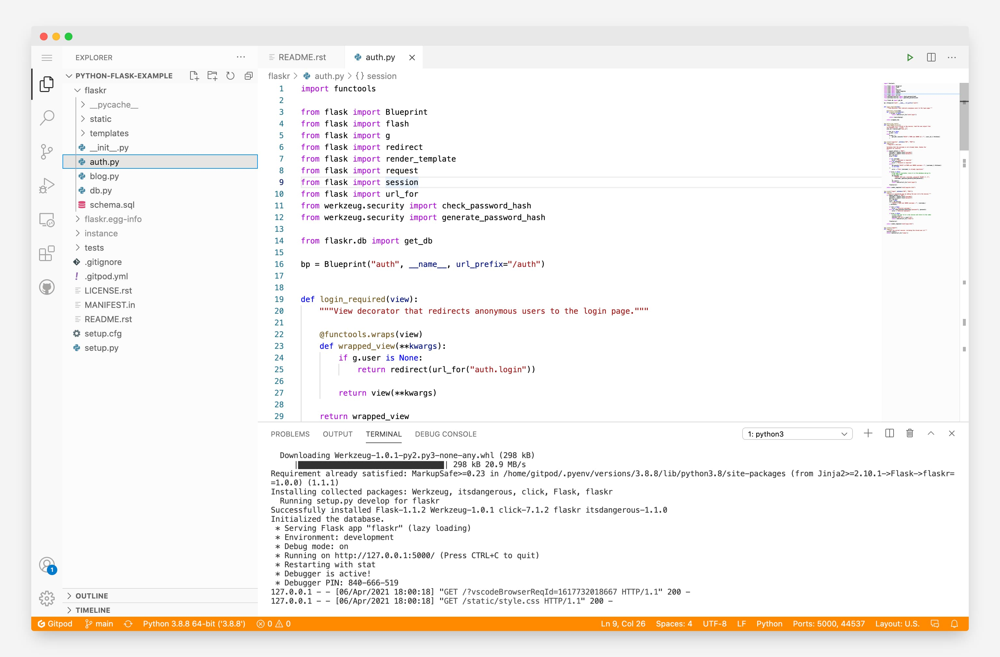

# {title}

VS Code Browser is the default editor that workspaces open in when using Gitpod. You can even [configure your VS Code extension](/docs/ides-and-editors/vscode-extensions) preferences by updating your .gitpod.yml.

## Changing the VS Code Browser version

VS Code Browser in Gitpod is based on a fork of [VS Code](https://github.com/microsoft/vscode) called [OpenVSCode Server
](https://github.com/gitpod-io/openvscode-server). VS Code in the browser in Gitpod is updated frequently, to use the latest nightly build of Gitpod you can switch to the "insiders" version of VS Code from [your Gitpod preferences page](https://gitpod.io/preferences).

## Settings Sync

By default, all your extensions and other preferences are synced between all of your workspaces on Gitpod. You can read more about over at [Settings Sync](settings-sync).
