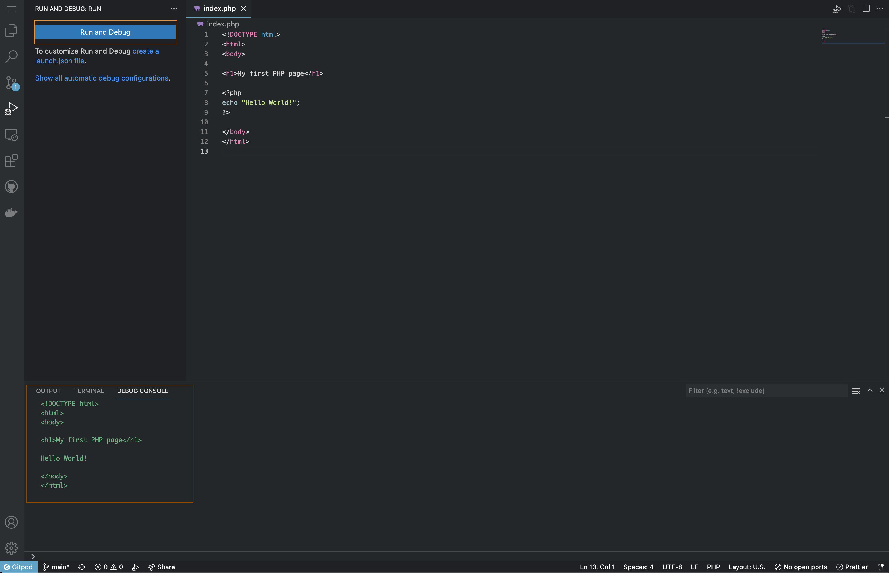

<script context="module">
  export const prerender = true;
</script>

# PHP in Gitpod

Gitpod supports PHP right out of the box, but more advanced features such as debugging can be configured, so here is how to do it!

## Example Repositories

<div class="overflow-x-auto">

| Repository                                                         | Description                                                                    | Try it                                                                                                                                        |
| ------------------------------------------------------------------ | ------------------------------------------------------------------------------ | --------------------------------------------------------------------------------------------------------------------------------------------- |
| [symfony-demo](https://github.com/gitpod-io/symfony-demo)          | A PHP/Symfony reference application following best practices                   | [](https://gitpod.io/#https://github.com/gitpod-io/symfony-demo)                |
| [magento2gitpod](https://github.com/nemke82/magento2gitpod)        | Magento 2 optimized setup for Gitpod: Nginx, MySQL, PHP 7.2, PHP-FPM and more  | [](https://gitpod.io/#https://github.com/nemke82/magento2gitpod)                |
| [koel](https://github.com/phanan/koel)                             | A personal music streaming server that works                                   | [](https://gitpod.io/#https://github.com/phanan/koel)                           |
| [drupal](https://github.com/bserem/gitpod-drupal-mysql-starterkit) | Drupal 9 with MySQL, suitable for site building and contrib module development | [](https://gitpod.io/#https://github.com/bserem/gitpod-drupal-mysql-starterkit) |
| [phpmyadmin](https://github.com/apolopena/gitpod-phpmyadmin)       | A phpMyAdmin example with Node.js, a REST API and MySQL for data persistence   | [](https://gitpod.io/#https://github.com/apolopena/gitpod-phpmyadmin)           |

</div>

## Debugging PHP in Gitpod



The PHP Debug extension allows debugging PHP applications from within Gitpod.

To get this extension for your project, you must do two things:

First, you must create a [.gitpod.Dockerfile](/docs/config-docker) for your repository:

```dockerfile
FROM gitpod/workspace-full

RUN sudo apt-get update && sudo apt-get install php-xdebug -y
```

Second, reference the above Dockerfile in a [.gitpod.yml](/docs/config-gitpod-file) file, and then also install the extension, like so:

```yaml
image:
  file: .gitpod.Dockerfile

vscode:
  extensions:
    - felixfbecker.php-debug
```

Head over to `Run and Debug` on the left hand side and have fun debugging PHP! You can also create a `launch.json` file.

Finally, here is a full [example repository](https://github.com/gitpod-io/Gitpod-PHP-Debug) containing the complete Gitpod PHP debug configuration described above. You can try it by clicking here:

[](https://gitpod.io/#https://github.com/gitpod-io/Gitpod-PHP-Debug)

## PECL Package Manager

Gitpod's default workspace image also comes with the [PECL](https://pecl.php.net/) package manager pre-installed. To install packages with it, you must use `sudo pecl install <EXTENSION>` in your repository's [.gitpod.Dockerfile](/docs/config-docker), e.g. like so:

```dockerfile
FROM gitpod/workspace-full

RUN sudo pecl channel-update pecl.php.net && \
    sudo pecl install <EXTENSION>
```

where `<EXTENSION>` is the PHP extension you want to install, e.g. `xdebug`.

## Further Reading

- <a class="no-nowrap" href="https://notes.etin.space/posts/gitpodifying-a-new-laravel-application">Gitpodifying a new Laravel Application</a> by Etin Obaseki
