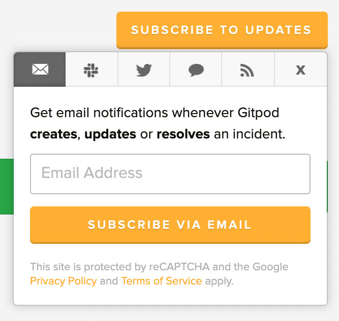
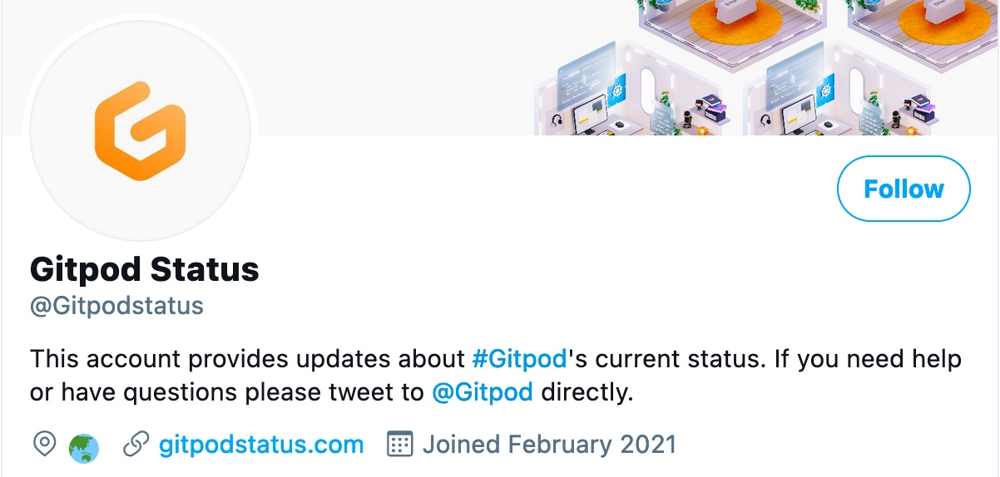

Availability and reliability are king. No feature at Gitpod will ever be as important as being a dependable service provider that our users and customers can rely on.

Right now, at Gitpod, there's a great deal of transformation happening behind the scenes thanks to our recently announced a <a href="https://www.gitpod.io/blog/next-chapter-for-gitpod">$13m funding round led</a> which has enabled us to accelerate building out a fully distributed world-class team (<a href="https://www.gitpod.io/careers">we are hiring</a>) that spans multiple timezones.

Today we are pleased to share with you our first increment on our journey towards greater transparency. Gitpod has moved on from our old `edit-markdown+git-push+run-werft-job` incident response loop and now migrated to an automated status page that is hosted independently of our core infrastructure.

# Subscribe to status updates

The new status page can be found at [www.gitpodstatus.com](www.gitpodstatus.com), and you can subscribe to service notifications via email, slack, twitter, webhooks, and Atom/RSS feeds.

In addition to this we have setup a dedicated twitter account at <a href="https://www.twitter.com/gitpodstatus/">@GitpodStatus</a>.

That's it for now. In future blog posts, our Site Reliability Engineer's will be sharing insights about Gitpod's journey towards [implementing alerting based on service level objectives](https://mads-hartmann.com/sre/2020/09/08/alerting-on-slos.html) and what our new incident processes look like behind the scenes.
