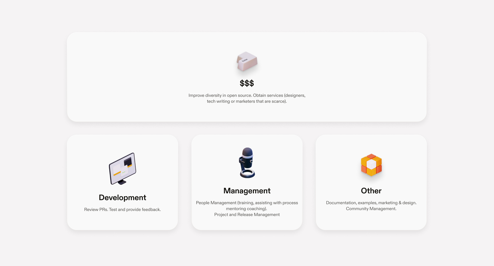

<CustomerHero
title="Lorem ipsum dolor sit amet Lorem ipsum"
text="Lorem ipsum dolor sit amet, consectetur adipiscing elit, sed do eiusmod tempor incididunt ut labore et dolore magna aliqua."
logo={{
		src: "/svg/customers/customer-io-mark.svg",
		alt: "customer.io"
	}}
card={{
		image: "/images/customers/customer-io/teaser.png",
		details:{
			industry: "Marketing",
			plan: "Startup, SaaS",
			noOfEngineers: "40+",
			website: {
				href: "https://customer.io",
				text: "customer.io",
			}
		}
	}}
/>

<CompanyBenefits
benefits={[
{
title: "3x",
text: "Lorem ipsum dolor sit amet, consectetur adipiscing elit, sed do eiusmod tempor",
},
{
title: "20%",
text: "Lorem ipsum dolor sit amet, consectetur adipiscing elit, sed do eiusmod tempor",
},
{
title: "+10k",
text: "Lorem ipsum dolor sit amet, consectetur adipiscing elit, sed do eiusmod tempor",
}]}
/>

<Section>
	<Quote 
		quote="Using Gitpod will improve your feature velocity and drastically reduce your
		cycle times from commit to deploy."
		author={{
			name: "Fabian Lange",
			jobTitle: "Founder & VP Engineering",
			company: "Instana"
		}}
	/>
</Section>

<Story bannerImg="/images/customers/customer-io/banner.png">

# DevX & Velocity

Lorem ipsum dolor sit amet, consectetur adipiscing elit, sed do eiusmod tempor incididunt ut labore et dolore magna aliqua.

The myriad of tools relied upon by developers every day is built and maintained almost exclusively by unpaid volunteers. The maintainers of open-source projects - our digital infrastructure - are in desperate need of support. Because code is less charismatic than a hit YouTube video or Kickstarter campaign, there is little public awareness and appreciation for this work.

Open-source, by design, is not financially sustainable. Finding reliable, well-defined funding sources is exceptionally challenging. As projects grow in size, many maintainers burn-out, find themselves unable to satisfy increasing support/maintenance demands and, unfortunately, in my particular case, <a href="https://ghuntley.com/a-new-chapter">irrevocably harm their marriage</a>.

<a href="https://twitter.com/freakboy3742">Russell Keith-Magee</a> delivered this beautiful keynote at PyCon, which captures the essence better than I can put in writing because it is such a personal topic.

`youtube: 0t85TyH-h04`

Much has changed since Russells' keynote and the infrastructure to financially support open-source maintainers now exists thanks to the efforts of Open Collective and GitHub Sponsors.

## Shape the future you want to live in

The truth is free software isn't free. How much is a task going to cost in person hours? Hours have rates. Rates require payment. Yet, an entire community of developers provide their services outside of their day job to produce tools consumed by businesses.

Did you know there are less than 2100 people in the inner GitHub open-source maintainer community?

**I often wonder what the future would look like if these high achievers that our digital society is built upon were empowered to become independent artists.** If just one of those people can help more people better understand a technology or improve the developer experience for an entire ecosystem what is the worth/value of that and why isn't our industry doing that yet?

The word volunteer, by definition, means those who have the ability and time to give freely.

Paying for resources that are being consumed broadens the list of people who can do open-source. Additionally, money enables open-source maintainers to buy services and outsource the activities that do not bring them joy.

At Gitpod, we firmly believe that working for an open-source project should be a legitimate alternative to a career working for a for-profit corporation. Additionally, we'd like everyone to be able to maintain open-source projects, not just people with the right financial background or youth that enables the ability to volunteer.

## Actions speak louder than words

Today we are announcing five things:

_Credit: [XKCD](https://xkcd.com/2347/)_

</Story>
